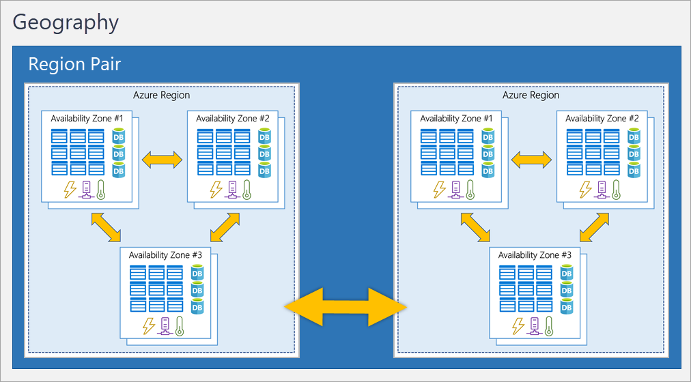

# Azure_Fundamentals

This Document has the purpose to create a collection of questions about Azure Fundamentals usable to understand how deeply you understood it.

# Usage

This document can be used to create a speech about the different Fundamentals areas of Azure. This process, hopefully, will lead to a self evaluation about the preparation for the **Exam AZ-900: Microsoft Azure Fundamentals**.
In this document will be presented different sections pertaining to the different areas of the Exam.
If you are determined to pass the exam, you should be able to describe Azure architectural components and Azure services, such as:

- Compute
- Networking
- Storage

You should also be able to describe features and tools to secure, govern, and administer Azure.
You should have skills and experience working with an area of IT, such as:

- Infrastructure management
- Database management
- Software development

In this document you will find the **Questions** used to recreate a speech about the Azure Fundamentals components, you should try it yourself, whenever you're stuck, is possible to check the answare that I propose. Let's start the journey!

# Here we start with the questions!
> **_NOTE_**: The questions will be divided in different sections depending on the subject.

> **_NOTE_**: The weight of each area in the exam is showed in the following table

| AZ-900 Domain Area                        | Weight   |
| ---------------------------------------- | -------- |
| Describe cloud concepts                  | 25-30%   |
| Describe Azure architecture and services | 35-40%   |
| Describe Azure management and governance | 30-35%   |

# Introduction
Let's warm up a bit...

  
<b>What is Azure?</b>

  Azure, often referred to as Microsoft Azure, is a cloud computing platform provided by Microsoft. It offers a wide range of services, including computing power, storage, networking, databases, analytics, artificial intelligence (AI), and Internet of Things (IoT), among others. Azure enables individuals and organizations to build, deploy, and manage applications and services through Microsoft's global network of data centers.

# Cloud concepts

Now we are redy to start, here will be asked questions about cloud concepts.

## Cloud computing

  
<b>What is Cloud Computing?</b>

  Cloud computing is the delivery of computing services over the internet. Computing services include common IT infrastructure such as virtual machines, storage, databases, and networking. Cloud services also expand the traditional IT offerings to include things like Internet of Things (IoT), machine learning (ML), and artificial intelligence (AI).

  
<b>What is the shared responsibility model?</b>

  The Shared Responsibility Model in cloud computing, including Azure, defines the division of responsibilities between the cloud service provider (CSP) and the customer. It outlines which aspects of security and management are handled by the cloud provider and which are the responsibility of the customer. This model is crucial for ensuring a secure and well-managed cloud environment.
  

You’ll always be responsible for:

- The information and data stored in the cloud
- Devices that are allowed to connect to your cloud (cell phones, computers, and so on)
- The accounts and identities of the people, services, and devices within your organization

The cloud provider is always responsible for:

- The physical datacenter
- The physical network
- The physical hosts

Your service model will determine responsibility for things like:

- Operating systems
- Network controls
- Applications
- Identity and infrastructure

  
<b>Define Cloud models</b>

  The cloud models define the deployment type of cloud resources. The three main cloud models are: 
  - private 
  - public
  - hybrid
  
### Private cloud
A private cloud is, in some ways, the natural evolution from a corporate datacenter. It’s a cloud (delivering IT services over the internet) that’s used by a single entity. Private cloud provides much greater control for the company and its IT department. However, it also comes with greater cost and fewer of the benefits of a public cloud deployment. Finally, a private cloud may be hosted from your on site datacenter. It may also be hosted in a dedicated datacenter offsite, potentially even by a third party that has dedicated that datacenter to your company.

### Public Cloud
A public cloud is built, controlled, and maintained by a third-party cloud provider. With a public cloud, anyone that wants to purchase cloud services can access and use resources. The general public availability is a key difference between public and private clouds.

### Hybrid Cloud
A hybrid cloud is a computing environment that uses both public and private clouds in an inter-connected environment. A hybrid cloud environment can be used to allow a private cloud to surge for increased, temporary demand by deploying public cloud resources. Hybrid cloud can be used to provide an extra layer of security. For example, users can flexibly choose which services to keep in public cloud and which to deploy to their private cloud infrastructure.

### Multi-Cloud
A fourth, and increasingly likely scenario is a multi-cloud scenario. In a multi-cloud scenario, you use multiple public cloud providers. Maybe you use different features from different cloud providers. Or maybe you started your cloud journey with one provider and are in the process of migrating to a different provider. Regardless, in a multi-cloud environment you deal with two (or more) public cloud providers and manage resources and security in both environments.

  
<b>How is the Cloud environment managed?</b>

  
  ### Azure Arc
  
  Azure Arc is a set of technologies that helps manage your cloud environment. Azure Arc can help manage your cloud environment, whether it's a public cloud solely on Azure, a private cloud in your datacenter, a hybrid configuration, or even a multi-cloud environment running on multiple cloud providers at once.

  
<b>Describe the consumption-based model</b>

  Operational Expenditure(OpEx) is spending money on services or products over time. Renting a convention center, leasing a company vehicle, or signing up for cloud services are all examples of OpEx.

Cloud computing falls under OpEx because cloud computing operates on a consumption-based model. With cloud computing, you don’t pay for the physical infrastructure, the electricity, the security, or anything else associated with maintaining a datacenter. Instead, you pay for the IT resources you use. If you don’t use any IT resources this month, you don’t pay for any IT resources.
This consumption-based model has many benefits, including:

- No upfront costs.
- No need to purchase and manage costly infrastructure that users might not use to its fullest potential.
- The ability to pay for more resources when they're needed.
- The ability to stop paying for resources that are no longer needed.

Cloud computing is the delivery of computing services over the internet by using a pay-as-you-go pricing model. You typically pay only for the cloud services you use.
Instead of maintaining CPUs and storage in your datacenter, you rent them for the time that you need them. The cloud provider takes care of maintaining the underlying infrastructure for you. The cloud enables you to quickly solve your toughest business challenges and bring cutting-edge solutions to your users.

## The benefit of using cloud services

  
<b>What are the key benefit concepts of cloud services?</b>

  The key benefit concepts are: 
  
  - Availability 
  - Scalability
  - Reliability
  - Predictability
  - Pecurity
  - Governance
  - Manageability 

### Availability
When you’re deploying an application, a service, or any IT resources, it’s important the resources are available when needed. High availability focuses on ensuring maximum availability, regardless of disruptions or events that may occur.

When you’re architecting your solution, you’ll need to account for service availability guarantees. Azure is a highly available cloud environment with uptime guarantees depending on the service. These guarantees are part of the service-level agreements (SLAs).
> **_NOTE_**: SLA is a formal agreement between the cloud platform and a customer, it garantee the customer a fixed level of services, like the up time percentage e.g. 99% or 99.9%

### Scalability
Another major benefit of cloud computing is the scalability of cloud resources. Scalability refers to the ability to adjust resources to meet demand. If you suddenly experience peak traffic and your systems are overwhelmed, the ability to scale means you can add more resources to better handle the increased demand.

The other benefit of scalability is that you aren't overpaying for services. Because the cloud is a consumption-based model, you only pay for what you use. If demand drops off, you can reduce your resources and thereby reduce your costs.

Scaling generally comes in two varieties: **vertical and horizontal**. **Vertical scaling** is focused on increasing or decreasing the capabilities of resources. **Horizontal scaling** is adding or subtracting the number of resources.

  
<b>Vertical sacling</b>

  With vertical scaling, if you were developing an app and you needed more processing power, you could vertically scale up to add more CPUs or RAM to the virtual machine. Conversely, if you realized you had over-specified the needs, you could vertically scale down by lowering the CPU or RAM specifications.

  
<b>Horizontal scaling</b>

  With horizontal scaling, if you suddenly experienced a steep jump in demand, your deployed resources could be scaled out (either automatically or manually). For example, you could add additional virtual machines or containers, scaling out. In the same manner, if there was a significant drop in demand, deployed resources could be scaled in (either automatically or manually), scaling in.

### Reliability
Reliability is the ability of a system to recover from failures and continue to function. It's also one of the pillars of the Microsoft Azure Well-Architected Framework.

The cloud, by virtue of its decentralized design, naturally supports a reliable and resilient infrastructure. With a decentralized design, the cloud enables you to have resources deployed in regions around the world. With this global scale, even if one region has a catastrophic event other regions are still up and running. You can design your applications to automatically take advantage of this increased reliability. In some cases, your cloud environment itself will automatically shift to a different region for you, with no action needed on your part. You’ll learn more about how Azure leverages global scale to provide reliability later in this series.

### Predictability
Predictability in the cloud lets you move forward with confidence. Predictability can be focused on performance predictability or cost predictability. Both performance and cost predictability are heavily influenced by the Microsoft Azure Well-Architected Framework. Deploy a solution that’s built around this framework and you have a solution whose cost and performance are predictable.

### Governance
Whether you’re deploying infrastructure as a service or software as a service, cloud features support governance and compliance. Things like set templates help ensure that all your deployed resources meet corporate standards and government regulatory requirements. Plus, you can update all your deployed resources to new standards as standards change. Cloud-based auditing helps flag any resource that’s out of compliance with your corporate standards and provides mitigation strategies. Depending on your operating model, software patches and updates may also automatically be applied, which helps with both governance and security.

### Security
On the security side, you can find a cloud solution that matches your security needs. If you want maximum control of security, infrastructure as a service provides you with physical resources but lets you manage the operating systems and installed software, including patches and maintenance. If you want patches and maintenance taken care of automatically, platform as a service or software as a service deployments may be the best cloud strategies for you.

And because the cloud is intended as an over-the-internet delivery of IT resources, cloud providers are typically well suited to handle things like distributed denial of service (DDoS) attacks, making your network more robust and secure.

## Manageability
A major benefit of cloud computing is the manageability options. There are two types of manageability for cloud computing that you’ll learn about in this series, and both are excellent benefits.

### Management of the cloud
Management of the cloud speaks to managing your cloud resources. In the cloud, you can:

- Automatically scale resource deployment based on need.
- Deploy resources based on a preconfigured template, removing the need for manual configuration.
- Monitor the health of resources and automatically replace failing resources.
- Receive automatic alerts based on configured metrics, so you’re aware of performance in real time.
 
### Management in the cloud
Management in the cloud speaks to how you’re able to manage your cloud environment and resources. You can manage these:

- Through a web portal.
- Using a command line interface.
- Using APIs.
- Using PowerShell.

## Cloud service type

  
<b>Describe Infrastructure as a Service</b>

  Infrastructure as a service (IaaS) is the most flexible category of cloud services, as it provides you the maximum amount of control for your cloud resources. In an IaaS model, the cloud provider is responsible for maintaining the hardware, network connectivity (to the internet), and physical security. You’re responsible for everything else: operating system installation, configuration, and maintenance; network configuration; database and storage configuration; and so on. With IaaS, you’re essentially renting the hardware in a cloud datacenter, but what you do with that hardware is up to you.

  ### Scenario:
  Some common scenarios where IaaS might make sense include:

  - Lift-and-shift migration: You’re standing up cloud resources similar to your on-prem datacenter, and then simply moving the things running on-prem to running on the IaaS infrastructure.
  - Testing and development: You have established configurations for development and test environments that you need to rapidly replicate. You can stand up or shut down the different environments rapidly with an IaaS structure, while maintaining complete control.
  

  
<b>Describe Platform as a Service</b>

  Platform as a service (PaaS) is a middle ground between renting space in a datacenter (infrastructure as a service) and paying for a complete and deployed solution (software as a service). In a PaaS environment, the cloud provider maintains the physical infrastructure, physical security, and connection to the internet. They also maintain the operating systems, middleware, development tools, and business intelligence services that make up a cloud solution. In a PaaS scenario, you don't have to worry about the licensing or patching for operating systems and databases.

PaaS is well suited to provide a complete development environment without the headache of maintaining all the development infrastructure.

  ### Scenario
  Some common scenarios where PaaS might make sense include:

  - Development framework: PaaS provides a framework that developers can build upon to develop or customize cloud-based applications. Similar to the way you create an Excel macro, PaaS lets developers create applications using built-in software components. Cloud features such as scalability, high-availability, and multi-tenant capability are included, reducing the amount of coding that developers must do.
  - Analytics or business intelligence: Tools provided as a service with PaaS allow organizations to analyze and mine their data, finding insights and patterns and predicting outcomes to improve forecasting, product design decisions, investment returns, and other business decisions.

  
<b>Describe Software as a Service</b>

  Software as a service (SaaS) is the most complete cloud service model from a product perspective. With SaaS, you’re essentially renting or using a fully developed application. Email, financial software, messaging applications, and connectivity software are all common examples of a SaaS implementation.

While the SaaS model may be the least flexible, it’s also the easiest to get up and running. It requires the least amount of technical knowledge or expertise to fully employ.

  ### Scenario
  Some common scenarios for SaaS are:

  - Email and messaging.
  - Business productivity applications.
  - Finance and expense tracking.

# Azure architecture and services
Good job till now, keep it up! Let's change topic! 
Mantain this Image as reference for all this topic

## Core architectural components of Azure

  
<b>Why do you need an Azure Account?</b>

  When you're working with your own applications and business needs, you need to create an Azure account, and a subscription will be created for you. After you've created an Azure account, you're free to create additional subscriptions. For example, your company might use a single Azure account for your business and separate subscriptions for development, marketing, and sales departments. After you've created an Azure subscription, you can start creating Azure resources within each subscription.

  
<b>Describe Azure physical infrastructure</b>

  
  
  The physical infrastructure for Azure starts with datacenters. Conceptually, the datacenters are the same as large corporate datacenters. They’re facilities with resources arranged in racks, with dedicated power, cooling, and networking infrastructure.

As a global cloud provider, Azure has datacenters around the world. However, these individual datacenters aren’t directly accessible. Datacenters are grouped into **Azure Regions** or **Azure Availability Zones** that are designed to help you achieve resiliency and reliability for your business-critical workloads.

### Azure Regions
A region is a geographical area on the planet that contains at least one, but potentially multiple datacenters that are nearby and networked together with a low-latency network. Azure intelligently assigns and controls the resources within each region to ensure workloads are appropriately balanced.

When you deploy a resource in Azure, you'll often need to choose the region where you want your resource deployed.

### Availability Zones
Availability zones are physically separate datacenters within an Azure region. Each availability zone is made up of one or more datacenters equipped with independent power, cooling, and networking. An availability zone is set up to be an isolation boundary. If one zone goes down, the other continues working. Availability zones are connected through high-speed, private fiber-optic networks.
>**__Note__**: To ensure resiliency, a minimum of three separate availability zones are present in all availability zone-enabled regions. However, not all Azure Regions currently support availability zones.

  
<b>Why and how Availability zones are used?</b>

  You want to ensure your services and data are redundant so you can protect your information in case of failure. When you host your infrastructure, setting up your own redundancy requires that you create duplicate hardware environments. Azure can help make your app highly available through availability zones.

You can use availability zones to run mission-critical applications and build high-availability into your application architecture by co-locating your compute, storage, networking, and data resources within an availability zone and replicating in other availability zones. Keep in mind that there could be a cost to duplicating your services and transferring data between availability zones.

Availability zones are primarily for VMs, managed disks, load balancers, and SQL databases. Azure services that support availability zones fall into three categories:

- Zonal services: You pin the resource to a specific zone (for example, VMs, managed disks, IP addresses).
- Zone-redundant services: The platform replicates automatically across zones (for example, zone-redundant storage, SQL Database).
- Non-regional services: Services are always available from Azure geographies and are resilient to zone-wide outages as well as region-wide outages.

Even with the additional resiliency that availability zones provide, it’s possible that an event could be so large that it impacts multiple availability zones in a single region. To provide even further resilience, Azure has **Region Pairs**.

### Region Pairs
Most Azure regions are paired with another region within the same geography (such as US, Europe, or Asia) at least 300 miles away. This approach allows for the replication of resources across a geography that helps reduce the likelihood of interruptions because of events such as natural disasters, civil unrest, power outages, or physical network outages that affect an entire region. For example, if a region in a pair was affected by a natural disaster, services would automatically fail over to the other region in its region pair.

**Additional advantages of region pairs**
- If an extensive Azure outage occurs, one region out of every pair is prioritized to make sure at least one is restored as quickly as possible for applications hosted in that region pair.
- Planned Azure updates are rolled out to paired regions one region at a time to minimize downtime and risk of application outage.
- Data continues to reside within the same geography as its pair (except for Brazil South) for tax- and law-enforcement jurisdiction purposes.

  
<b>Describe Azure management infrastructure</b>

  The management infrastructure includes Azure resources and resource groups, subscriptions, and accounts. Understanding the hierarchical organization will help you plan your projects and products within Azure.
  
  ### Azure resources and resource groups
  
  A **resource** is the basic building block of Azure. Anything you create, provision, deploy, etc. is a resource. Virtual Machines (VMs), virtual networks, databases, cognitive services, etc. are all considered resources within Azure.
  **Resource groups** are simply groupings of resources. When you create a resource, you’re required to place it into a resource group. While a resource group can contain many resources, a single resource can only be in one resource group at a time. Some resources may be moved between resource groups, but when you move a resource to a new group, it will no longer be associated with the former group. Additionally, resource groups can't be nested, meaning you can’t put resource group B inside of resource group A.
  Resource groups provide a convenient way to group resources together. When you apply an action to a resource group, that action will apply to all the resources within the resource group. If you delete a resource group, all the resources will be deleted. If you grant or deny access to a resource group, you’ve granted or denied access to all the resources within the resource group.

When you’re provisioning resources, it’s good to think about the resource group structure that best suits your needs.

For example, if you’re setting up a temporary dev environment, grouping all the resources together means you can deprovision all of the associated resources at once by deleting the resource group. If you’re provisioning compute resources that will need three different access schemas, it may be best to group resources based on the access schema, and then assign access at the resource group level.

### Azure subscriptions

In Azure, subscriptions are a unit of management, billing, and scale. Similar to how resource groups are a way to logically organize resources, subscriptions allow you to logically organize your resource groups and facilitate billing.
Using Azure requires an Azure subscription. A subscription provides you with authenticated and authorized access to Azure products and services. It also allows you to provision resources. An Azure subscription links to an Azure account, which is an identity in Microsoft Entra ID or in a directory that Microsoft Entra ID trusts.

An account can have multiple subscriptions, but it’s only required to have one. In a multi-subscription account, you can use the subscriptions to configure different billing models and apply different access-management policies. You can use Azure subscriptions to define boundaries around Azure products, services, and resources. There are two types of subscription boundaries that you can use:

- **Billing boundary:** This subscription type determines how an Azure account is billed for using Azure. You can create multiple subscriptions for different types of billing requirements. Azure generates separate billing reports and invoices for each subscription so that you can organize and manage costs.
- **Access control boundary:** Azure applies access-management policies at the subscription level, and you can create separate subscriptions to reflect different organizational structures. An example is that within a business, you have different departments to which you apply distinct Azure subscription policies. This billing model allows you to manage and control access to the resources that users provision with specific subscriptions.

### Create additional Azure subscriptions
Similar to using resource groups to separate resources by function or access, you might want to create additional subscriptions for resource or billing management purposes. For example, you might choose to create additional subscriptions to separate:

- Environments: You can choose to create subscriptions to set up separate environments for development and testing, security, or to isolate data for compliance reasons. This design is particularly useful because resource access control occurs at the subscription level.
- Organizational structures: You can create subscriptions to reflect different organizational structures. For example, you could limit one team to lower-cost resources, while allowing the IT department a full range. This design allows you to manage and control access to the resources that users provision within each subscription.
- Billing: You can create additional subscriptions for billing purposes. Because costs are first aggregated at the subscription level, you might want to create subscriptions to manage and track costs based on your needs. For instance, you might want to create one subscription for your production workloads and another subscription for your development and testing workloads.

  ### Azure Management Groups
  The final piece is the management group. Resources are gathered into resource groups, and resource groups are gathered into subscriptions. If you’re just starting in Azure that might seem like enough hierarchy to keep things organized. But imagine if you’re dealing with multiple applications, multiple development teams, in multiple geographies.

If you have many subscriptions, you might need a way to efficiently manage access, policies, and compliance for those subscriptions. Azure management groups provide a level of scope above subscriptions. You organize subscriptions into containers called management groups and apply governance conditions to the management groups. All subscriptions within a management group automatically inherit the conditions applied to the management group, the same way that resource groups inherit settings from subscriptions and resources inherit from resource groups. Management groups give you enterprise-grade management at a large scale, no matter what type of subscriptions you might have. Management groups can be nested.

You can build a flexible structure of management groups and subscriptions to organize your resources into a hierarchy for unified policy and access management. The following diagram shows an example of creating a hierarchy for governance by using management groups.

## Azure compute and networking services

  
<b>Describe Azure virtual machines</b>

  With Azure Virtual Machines (VMs), you can create and use VMs in the cloud. VMs provide infrastructure as a service (IaaS) in the form of a virtualized server and can be used in many ways. Just like a physical computer, you can customize all of the software running on your VM. VMs are an ideal choice when you need:

- Total control over the operating system (OS).
- The ability to run custom software.
- To use custom hosting configurations.
  
An Azure VM gives you the flexibility of virtualization without having to buy and maintain the physical hardware that runs the VM. However, as an IaaS offering, you still need to configure, update, and maintain the software that runs on the VM.

You can even create or use an already created image to rapidly provision VMs. You can create and provision a VM in minutes when you select a preconfigured VM image. An image is a template used to create a VM and may already include an OS and other software, like development tools or web hosting environments.

  
<b>What is the meaning of Scale VMs in Azure</b>

  You can run single VMs for testing, development, or minor tasks. Or you can group VMs together to provide high availability, scalability, and redundancy. Azure can also manage the grouping of VMs for you with features such as scale sets and availability sets.

  ### Virtual machine scale sets
  Scale sets allow you to centrally manage, configure, and update a large number of VMs in minutes. The number of VM instances can automatically increase or decrease in response to demand, or you can set it to scale based on a defined schedule. Virtual machine scale sets also automatically deploy a load balancer to make sure that your resources are being used efficiently. With virtual machine scale sets, you can build large-scale services for areas such as compute, big data, and container workloads.

  ### Virtual machine availability sets
  availability sets are another tool to help you build a more resilient, highly available environment. Availability sets are designed to ensure that VMs stagger updates and have varied power and network connectivity, preventing you from losing all your VMs with a single network or power failure.

  Availability sets do this by grouping VMs in two ways: update domain and fault domain.

- Update domain: The update domain groups VMs that can be rebooted at the same time. This allows you to apply updates while knowing that only one update domain grouping will be offline at a time. All of the machines in one update domain will be updated. An update group going through the update process is given a 30-minute time to recover before maintenance on the next update domain starts.
- Fault domain: The fault domain groups your VMs by common power source and network switch. By default, an availability set will split your VMs across up to three fault domains. This helps protect against a physical power or networking failure by having VMs in different fault domains (thus being connected to different power and networking resources).

  
<b>Describe Azure virtual desktop</b>

  Azure Virtual Desktop is a desktop and application virtualization service that runs on the cloud. It enables you to use a cloud-hosted version of Windows from any location. Azure Virtual Desktop works across devices and operating systems, and works with apps that you can use to access remote desktops or most modern browsers.

  
<b>Describe Azure containers</b>

  While virtual machines are an excellent way to reduce costs versus the investments that are necessary for physical hardware, they're still limited to a single operating system per virtual machine. If you want to run multiple instances of an application on a single host machine, containers are an excellent choice.
  Containers are a virtualization environment. Much like running multiple virtual machines on a single physical host, you can run multiple containers on a single physical or virtual host. Unlike virtual machines, you don't manage the operating system for a container. Virtual machines appear to be an instance of an operating system that you can connect to and manage. Containers are lightweight and designed to be created, scaled out, and stopped dynamically. It's possible to create and deploy virtual machines as application demand increases, but containers are a lighter weight, more agile method. Containers are designed to allow you to respond to changes on demand. With containers, you can quickly restart if there's a crash or hardware interruption. One of the most popular container engines is Docker, and Azure supports Docker.
>**_NOTE_**: The difference between Container Interfaces and Container app is the ability of the later to incorporate load balancing and scaling.

  
<b>Describe Azure functions</b>

  Azure Functions is an event-driven, serverless compute option that doesn’t require maintaining virtual machines or containers. If you build an app using VMs or containers, those resources have to be “running” in order for your app to function. With Azure Functions, an event wakes the function, alleviating the need to keep resources provisioned when there are no events.
  Using Azure Functions is ideal when you're only concerned about the code running your service and not about the underlying platform or infrastructure. Functions are commonly used when you need to perform work in response to an event (often via a REST request), timer, or message from another Azure service, and when that work can be completed quickly, within seconds or less.

Functions scale automatically based on demand, so they may be a good choice when demand is variable.

Azure Functions runs your code when it's triggered and automatically deallocates resources when the function is finished. In this model, you're only charged for the CPU time used while your function runs.

Functions can be either stateless or stateful. When they're stateless (the default), they behave as if they're restarted every time they respond to an event. When they're stateful (called Durable Functions), a context is passed through the function to track prior activity.

Functions are a key component of serverless computing. They're also a general compute platform for running any type of code. If the needs of the developer's app change, you can deploy the project in an environment that isn't serverless. This flexibility allows you to manage scaling, run on virtual networks, and even completely isolate the functions.

  
<b>What is Azure App Service?</b>

  App Service enables you to build and host web apps, background jobs, mobile back-ends, and RESTful APIs in the programming language of your choice without managing infrastructure. It offers automatic scaling and high availability. App Service supports Windows and Linux. It enables automated deployments from GitHub, Azure DevOps, or any Git repo to support a continuous deployment model.

Azure App Service is a robust hosting option that you can use to host your apps in Azure. Azure App Service lets you focus on building and maintaining your app, and Azure focuses on keeping the environment up and running.

Azure App Service is an HTTP-based service for hosting web applications, REST APIs, and mobile back ends. It supports multiple languages, including .NET, .NET Core, Java, Ruby, Node.js, PHP, or Python. It also supports both Windows and Linux environments.

  
<b>Describe Azure virtual networking</b>

  Azure virtual networks and virtual subnets enable Azure resources, such as VMs, web apps, and databases, to communicate with each other, with users on the internet, and with your on-premises client computers. You can think of an Azure network as an extension of your on-premises network with resources that link other Azure resources.

  Azure virtual networks provide the following key networking capabilities:

- Isolation and segmentation
- Internet communications
- Communicate between Azure resources
- Communicate with on-premises resources
- Route network traffic
- Filter network traffic
- Connect virtual networks
  

  
<b>Describe Azure virtual private networks</b>

  A virtual private network (VPN) uses an encrypted tunnel within another network. VPNs are typically deployed to connect two or more trusted private networks to one another over an untrusted network (typically the public internet). Traffic is encrypted while traveling over the untrusted network to prevent eavesdropping or other attacks. VPNs can enable networks to safely and securely share sensitive information.

  
<b>Describe Azure ExpressRoute</b>

  Azure ExpressRoute lets you extend your on-premises networks into the Microsoft cloud over a private connection, with the help of a connectivity provider. This connection is called an ExpressRoute Circuit. With ExpressRoute, you can establish connections to Microsoft cloud services, such as Microsoft Azure and Microsoft 365. This allows you to connect offices, datacenters, or other facilities to the Microsoft cloud. Each location would have its own ExpressRoute circuit.

Connectivity can be from an any-to-any (IP VPN) network, a point-to-point Ethernet network, or a virtual cross-connection through a connectivity provider at a colocation facility. ExpressRoute connections don't go over the public Internet. This allows ExpressRoute connections to offer more reliability, faster speeds, consistent latencies, and higher security than typical connections over the Internet.

  
<b>Describe Azure DNS</b>

  Azure DNS is a hosting service for DNS domains that provides name resolution by using Microsoft Azure infrastructure. By hosting your domains in Azure, you can manage your DNS records using the same credentials, APIs, tools, and billing as your other Azure services.
Azure DNS leverages the scope and scale of Microsoft Azure to provide numerous benefits, including:

- Reliability and performance
- Security
- Ease of Use
- Customizable virtual networks
- Alias records
  

## Azure storage services

  
<b>Describe Azure storage accounts</b>

  A storage account provides a unique namespace for your Azure Storage data that's accessible from anywhere in the world over HTTP or HTTPS. Data in this account is secure, highly available, durable, and massively scalable.

When you create your storage account, you’ll start by picking the storage account type. The type of account determines the storage services and redundancy options and has an impact on the use cases. Below is a list of redundancy options that will be covered later in this module:

- Locally redundant storage (LRS)
- Geo-redundant storage (GRS)
- Read-access geo-redundant storage (RA-GRS)
- Zone-redundant storage (ZRS)
- Geo-zone-redundant storage (GZRS)
- Read-access geo-zone-redundant storage (RA-GZRS)
  

  
<b>Describe Azure storage redundancy</b>

  Azure Storage always stores multiple copies of your data so that it's protected from planned and unplanned events such as transient hardware failures, network or power outages, and natural disasters. Redundancy ensures that your storage account meets its availability and durability targets even in the face of failures.

When deciding which redundancy option is best for your scenario, consider the tradeoffs between lower costs and higher availability. The factors that help determine which redundancy option you should choose include:

- How your data is replicated in the primary region.
- Whether your data is replicated to a second region that is geographically distant to the primary region, to protect against regional disasters.
- Whether your application requires read access to the replicated data in the secondary region if the primary region becomes unavailable.

### Redundancy in the primary region
Data in an Azure Storage account is always replicated three times in the primary region. Azure Storage offers two options for how your data is replicated in the primary region, locally redundant storage (LRS) and zone-redundant storage (ZRS).

- Locally redundant storage (LRS) replicates your data three times within a single data center in the primary region.
- For Availability Zone-enabled Regions, zone-redundant storage (ZRS) replicates your Azure Storage data synchronously across three Azure availability zones in the primary region.

### Redundancy in a secondary region
For applications requiring high durability, you can choose to additionally copy the data in your storage account to a secondary region that is hundreds of miles away from the primary region. If the data in your storage account is copied to a secondary region, then your data is durable even in the event of a catastrophic failure that prevents the data in the primary region from being recovered.

When you create a storage account, you select the primary region for the account. The paired secondary region is based on Azure Region Pairs, and can't be changed.

- Geo-Redundant Storage (GRS) copies your data synchronously three times within a single physical location in the primary region using LRS. It then copies your data asynchronously to a single physical location in the secondary region (the region pair) using LRS.
- Geo-zone-redundant storage (GZRS) combines the high availability provided by redundancy across availability zones with protection from regional outages provided by geo-replication. Data in a GZRS storage account is copied across three Azure availability zones in the primary region (similar to ZRS) and is also replicated to a secondary geographic region, using LRS, for protection from regional disasters. Microsoft recommends using GZRS for applications requiring maximum consistency, durability, and availability, excellent performance, and resilience for disaster recovery.

  
<b>What are the components of Azure storage services?</b>

  The Azure Storage platform includes the following data services:

- Azure Blobs: A massively scalable object store for text and binary data. Also includes support for big data analytics through Data Lake Storage Gen2.
- Azure Files: Managed file shares for cloud or on-premises deployments.
- Azure Queues: A messaging store for reliable messaging between application components.
- Azure Disks: Block-level storage volumes for Azure VMs.
- Azure Tables: NoSQL table option for structured, non-relational data.
  

  
<b>Question</b>

  answer

  
<b>Question</b>

  answer

  
<b>Question</b>

  answer

