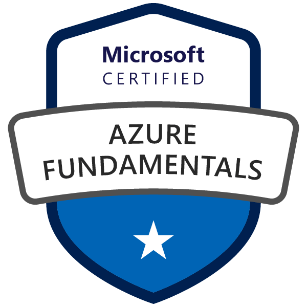

# Azure_Fundamentals

This Document has the purpose to create a collection of questions about Azure Fundamentals usable to understand how deeply you understood it.
_________________

# Usage

This document can be used to create a speech about the different Fundamentals areas of Azure. This process, hopefully, will lead to a self evaluation about the preparation for the **Exam AZ-900: Microsoft Azure Fundamentals**.
In this document will be presented different sections pertaining to the different areas of the Exam.
If you are determined to pass the exam, you should be able to describe Azure architectural components and Azure services, such as:

- Compute
- Networking
- Storage

You should also be able to describe features and tools to secure, govern, and administer Azure.
You should have skills and experience working with an area of IT, such as:

- Infrastructure management
- Database management
- Software development

In this document you will find the **Questions** used to recreate a speech about the Azure Fundamentals components, you should try it yourself, whenever you're stuck, is possible to check the answare that I propose. Let's start the journey!

# Here we start with the questions!
> **_NOTE_**: The questions will be divided in different sections depending on the subject.

> **_NOTE_**: The weight of each area in the exam is showed in the following table

| AZ-900 Domain Area                        | Weight   |
| ---------------------------------------- | -------- |
| Describe cloud concepts                  | 25-30%   |
| Describe Azure architecture and services | 35-40%   |
| Describe Azure management and governance | 30-35%   |

## Introduction

  
<b>What is Azure?</b>

  Azure, often referred to as Microsoft Azure, is a cloud computing platform provided by Microsoft. It offers a wide range of services, including computing power, storage, networking, databases, analytics, artificial intelligence (AI), and Internet of Things (IoT), among others. Azure enables individuals and organizations to build, deploy, and manage applications and services through Microsoft's global network of data centers.

## Cloud computing

  
<b>What is Cloud Computing?</b>

  Cloud computing is the delivery of computing services over the internet. Computing services include common IT infrastructure such as virtual machines, storage, databases, and networking. Cloud services also expand the traditional IT offerings to include things like Internet of Things (IoT), machine learning (ML), and artificial intelligence (AI).

  
<b>What is the shared responsibility model?</b>

  The Shared Responsibility Model in cloud computing, including Azure, defines the division of responsibilities between the cloud service provider (CSP) and the customer. It outlines which aspects of security and management are handled by the cloud provider and which are the responsibility of the customer. This model is crucial for ensuring a secure and well-managed cloud environment. 

  
<b>Question</b>

  answer

  
<b>Question</b>

  answer

  
<b>Question</b>

  answer

  
<b>Question</b>

  answer

  
<b>Question</b>

  answer

  
<b>Question</b>

  answer

  
<b>Question</b>

  answer

  
<b>Question</b>

  answer

